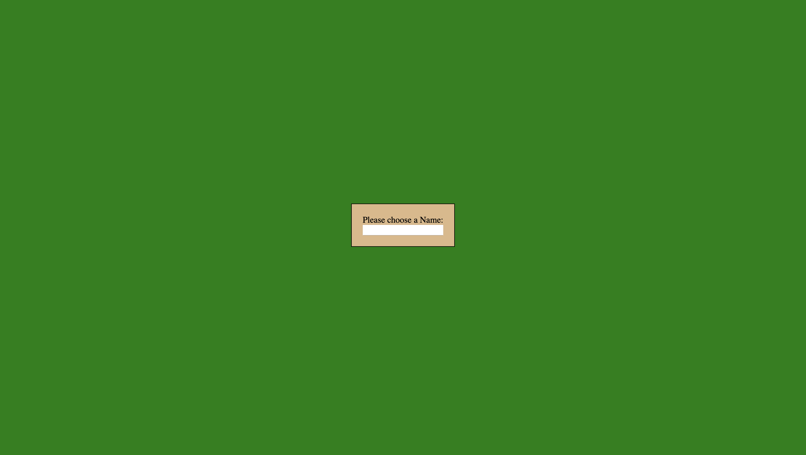
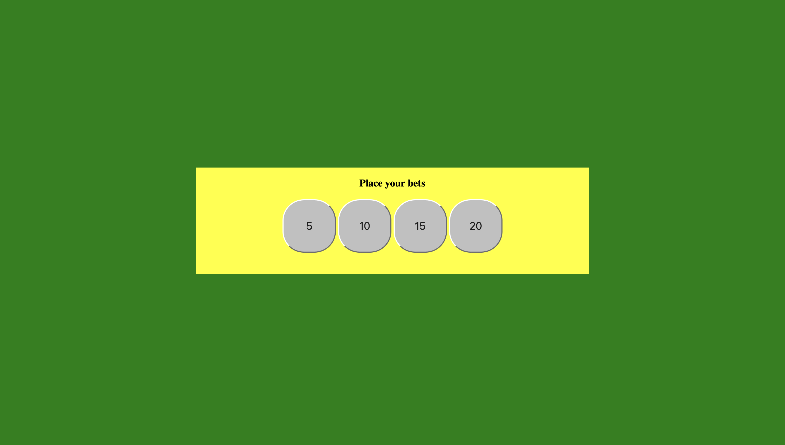
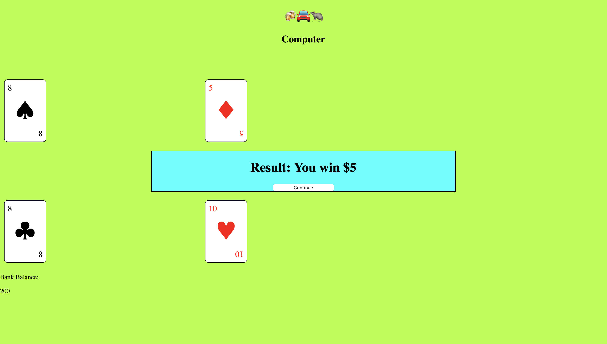

## BarCarRat

https://lee-lionel.github.io/BarCarRat/

The goal of this Baccarat game is to have a hand that has higher points than your opponent (in this case referring to the computer) start by declaring your initial bet -> amount that determines how much you win or lose. Both parties will start with 2 cards in hand, and you can draw an additional card if you are unhappy with the points of their hand. If the points in your hand is more than the computer, you win, vice versa. For a comprehensive guide on how to play the game, refer to rules.txt.

## HTML 
- `input`: `playerInput` for the player to key in his/her name
–  A collection of `div` elements to display my game
i.e. 
`wagerContainer` : the player to choose how much he wants to bet
`playerHand` and `computerHand` : store the cards in respective player hands
`bankBalance` : display the player’s bank balance

## CSS 
The styling for the game. Mainly using simple CSS to style the game board and the cards. `Red` and `Black` classes are defined here to render the colours of the card by using ClassList

## Javascript 
This file mainly handles game logic
It includes:
Classes - Player, Deck, Cards
Player Class: contain playerName and bankBalance - which will display the name and amount of money the player has left 
Deck class: contain cards that can run the `shuffle` method to shuffle the cards in deck
Cards class: contain suit and values, and the method to print the card in HTML, `renderCard`

# Global Variable declaration: 
`newPlayer` – the player object that will be initiated later after the user inputs his Ign
`wagerAmt` – the amount of money that the player decides to bet on – initially at 0 until he clicks the button 
`natural` - a boolean variable that tests for auto win conditions
`results` - a string that contains the result of the game
`winLose` - an integer that is used to calculate win loss logic, 0 if its a tie, -1 if u lose, 1 if u win
`multiplier` - an integer that controls how much u win/lose based on your hand combination

Event Listeners: 
button onclicks that will return their id for the functions to carry out their actions – ie the `wagerButtons`, the corresponding ids reflect how much a player chooses to bet

`controlButtons`, depending whether u click hit/stand, runs the `controlClick()` function

# Functions: 
`generateDeck()` is a function that creates an array of cards
`drawCard()` is a function that takes in the parameters (player or computer) and pushes the top card of the deck into the corresponding player hand
`checkForNatural()` is a function that checks for a auto win game state before proceeding with the game
`handValue()` is a function that adds the value of the player hand, based on the parameters passed in
`compareHands()` is a function that compares both parties and return the result
`determineWinner()` is a function that computes the `winLose` variable
`generateMultiplier()` is a function that computes the `multiplier` based on hand combination. Normal circumstances the multiplier is 1
`payOut()` is a function that calculates how much the `player` wins/loses based on the `wagerAmt`

## Future upgrades
More players?
Top up function?