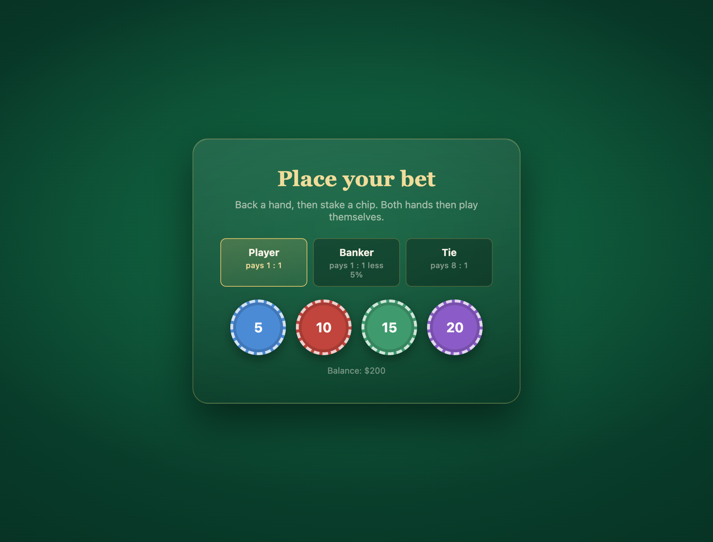
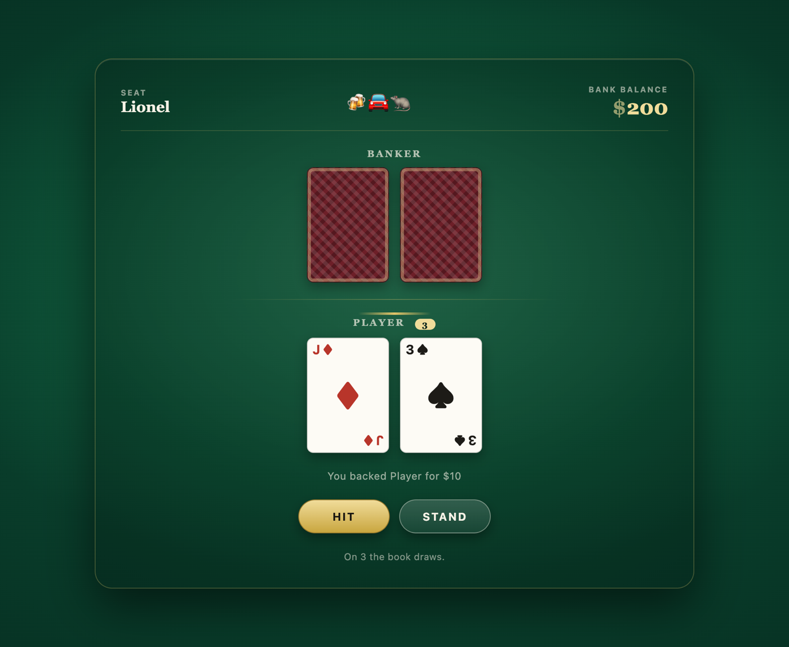
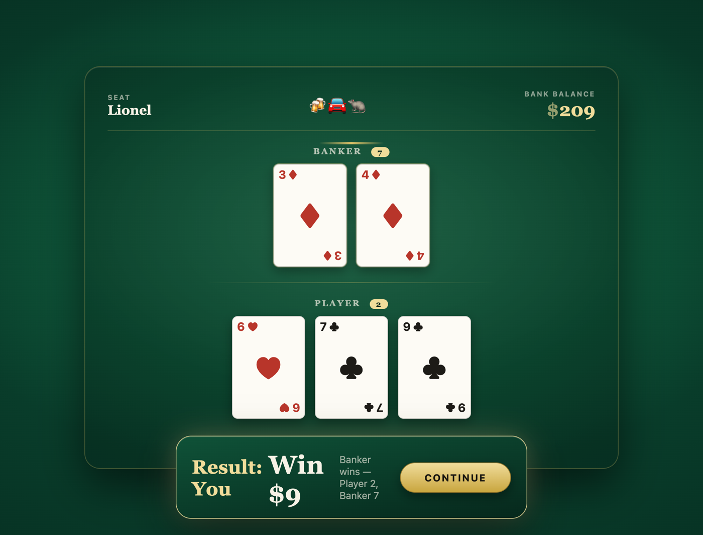
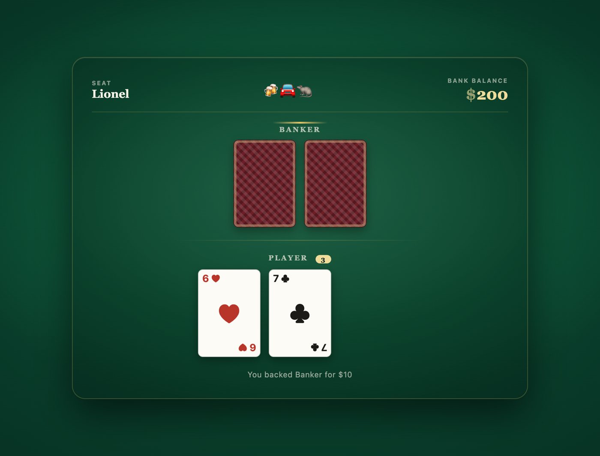
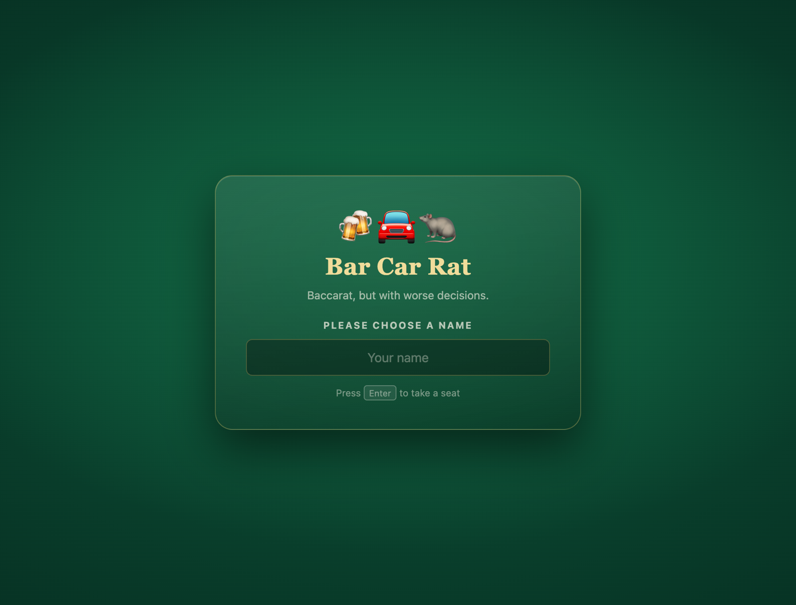

# Bar Car Rat

**Baccarat, but with worse decisions.** Punto banco in the browser — no build
step, no dependencies, three files.

▶︎ **[Play it](https://lee-lionel.github.io/BarCarRat/)**



## How the game works

Stake a chip. You and the banker are dealt two cards each, the banker's face
down.

At a real table nobody decides anything from here: the player hand draws on
0–5 by rule. **This table gives you that call.** Hit or stand as you like; the
book's advice is printed under the buttons and ignoring it is the entire
premise. The banker still plays strictly by the published table.

**Card values.** Ace is 1, two through nine are face value, and ten, jack,
queen and king are all **zero**. A hand is the sum of its cards **modulo ten**,
so 7 + 8 = 15 counts as 5. The best possible hand is 9.

**A natural.** If either hand totals 8 or 9 on its first two cards, the round
ends immediately and neither hand draws.

**The Player hand** would draw on 0–5 and stand on 6–7. That's the advice
shown under Hit and Stand — here it's yours to overrule.

**The Banker hand** is the fiddly one. If the Player stood, the Banker uses the
same rule — draws on 0–5, stands on 6–7. If the Player drew, whether the Banker
draws depends on the Banker's total *and* the card the Player drew:

| Banker total | Draws when the Player's third card is |
| ------------ | ------------------------------------- |
| 0–2          | anything                              |
| 3            | anything except 8                     |
| 4            | 2–7                                   |
| 5            | 4–7                                   |
| 6            | 6–7                                   |
| 7            | stands                                |





## Hands and what they pay

Points decide most rounds, but some shapes are worth more than their points —
and four of them win outright no matter what the points say. A straight of
4-5-6 counts **5** in baccarat, and three pictures counts **0**, the worst
total in the game. Without an auto-win rule the best-looking hands on the felt
would be the ones that lose.

Payouts are ordered by how often each hand actually appears in three cards
from a 52-card deck, so a rarer hand always pays more:

| Hand            | Frequency | Pays | Wins outright |
| --------------- | --------- | ---- | ------------- |
| Straight flush  | 0.20 %    | 6×   | yes           |
| Three of a kind | 0.24 %    | 5×   | yes           |
| Three pictures  | 0.92 %    | 4×   | yes           |
| Straight        | 2.71 %    | 3×   | yes           |
| Flush           | 4.98 %    | 3×   | no            |
| Pair            | 16.29 %   | 2×   | no            |
| Anything else   | 74.66 %   | 1×   | no            |

Two-card hands keep the original rule: a **pair** or a **matched suit** pays 2×.

A hand that wins outright beats any hand ranked below it. Two hands of the same
rank fall back to points. **Flush** and **pair** are bonuses only — they still
have to win on points, they just change what the win is worth.

The multiplier cuts both ways. The banker drawing a straight flush against you
costs six times your stake, exactly as it would pay six times if it were
yours. A tie is a **push**: the stake comes back.

Those frequencies aren't guesses — the test suite classifies all 22,100
possible three-card hands and checks the counts against them.

The table posts all of this in-game too, behind **Paytable** on the betting
screen. You should not have to read a repository to know what a hand pays.

## At the table



The round is dealt Player, Banker, Player, Banker, with the Banker's hand face
down. Cards slide in off the shoe one at a time. You take your card or stand,
the hand is called (*Natural*, *Player stands*, *Banker draws*), the Banker's
cards turn over one by one, and only then does the balance move and the result
appear. Nothing resolves on top of the deal.

A gold rail marks the hand you backed. The winning hand lifts and glows.



## The code

| File         | What's in it                                                     |
| ------------ | ---------------------------------------------------------------- |
| `index.html` | Four panels — seat, table, betting, result — toggled by display   |
| `script.js`  | The rules, then the table                                        |
| `style.css`  | Felt, cards, chips, and the deal / flip / reveal animations       |

The rules live in pure functions with no DOM and no timing —
`totalOf`, `isNatural`, `playerDraws`, `bankerDraws`, `winningSide`, `settle` —
plus `evaluateHand` for the shapes above — so they can be checked directly
against the tables. `playerDraws` is what the advice line reports rather than
what the game enforces; the banker's rule is enforced exactly.

`prefers-reduced-motion` is respected throughout; the animation collapses and
the game plays instantly.

## Running it

No build. Open `index.html`, or serve the folder:

```bash
python3 -m http.server 4600
# then visit http://localhost:4600
```
